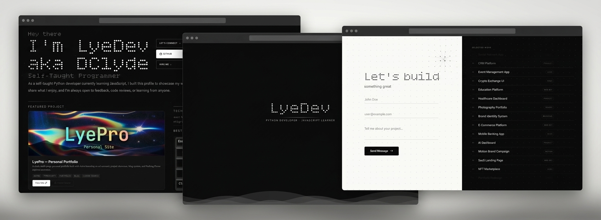
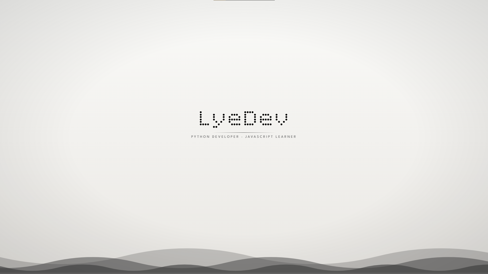
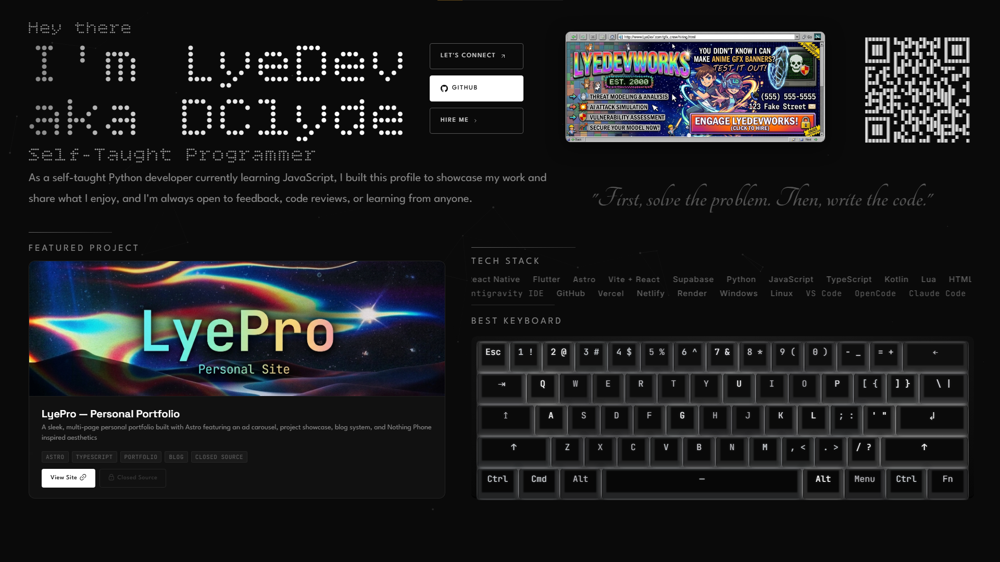
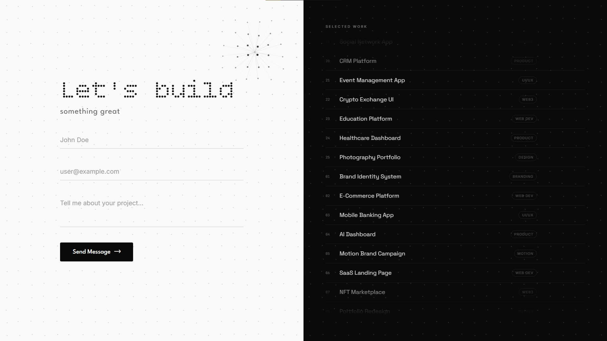

# LyeDev

**A free, open-source personal portfolio template built with Astro — fork it, make it yours.**

<!-- TODO: Add badges -->
<!-- [](./LICENSE) -->
<!-- [](https://astro.build) -->

---

## About

LyeDev is a copyable personal portfolio template designed for developers who want a clean, dark-themed site without building from scratch. It's built by a self-taught dev (not a company), meant to be forked, customized, and deployed in minutes. Use it as-is or strip it down to whatever fits your vibe.

Aliased as **LyePro** / **DClyde**.

---

## Preview

| Hero | About | Contact |
|------|-------|---------|
|  |  |  |

---

## Features

- **Multi-page layout** — Hero, About, Projects, Blog, Contact sections
- **Featured project showcase** — Highlight your best work with images, tags, and links
- **Tech stack display** — Show off your skills with a clean marquee or grid
- **Blog system** — Write posts with Astro's content collections
- **Contact form** — Get in touch without第三方 services
- **Dark mode UI** — Clean black/white aesthetic with retro dotted/pixel heading style
- **Responsive design** — Looks good on mobile, tablet, and desktop
- **Fast by default** — Static site generation via Astro, no runtime overhead
- **Easy to customize** — Swap colors, fonts, content, and images to make it yours

---

## Tech Stack

| Layer | Tool |
|-------|------|
| Framework | [Astro](https://astro.build) |
| UI | [React](https://react.dev) + [Vite](https://vitejs.dev) |
| Language | [TypeScript](https://www.typescriptlang.org) |
| Backend | [Supabase](https://supabase.com) |
| Deploy | [Vercel](https://vercel.com) / [Netlify](https://netlify.com) |

---

## Getting Started

### Prerequisites

- Node.js 18+ (22+ recommended)
- npm, pnpm, or yarn

### Installation

```sh
# Clone the repo
git clone https://github.com/famyXpng/LyeDev.git

# Enter the project
cd LyeDev

# Install dependencies
npm install

# Start the dev server
npm run dev
```

Site runs at `http://localhost:4321`

### Commands

| Command | Action |
|---------|--------|
| `npm install` | Install dependencies |
| `npm run dev` | Start dev server |
| `npm run build` | Build for production |
| `npm run preview` | Preview production build |
| `npm run astro add` | Add integrations (React, Tailwind, etc.) |

---

## Project Structure

```
LyeDev/
├── public/              # Static assets (images, fonts, icons)
├── src/
│   ├── components/      # React/UI components
│   ├── content/         # Blog posts, project data
│   ├── layouts/         # Page layouts
│   ├── pages/           # Route pages (index, about, blog, etc.)
│   └── styles/          # Global CSS
├── astro.config.mjs     # Astro configuration
├── package.json
└── tsconfig.json
```

---

## Using This as a Template

1. **Fork or clone** this repo
2. **Replace the content** — swap out my name, bio, projects, and links with yours
3. **Update the images** — replace the banner, project thumbnails, and profile photos
4. **Customize the colors** — edit the CSS variables or Tailwind config to match your brand
5. **Add your projects** — create new entries in the projects section or content collection
6. **Set up Supabase** — if using the contact form or blog, connect your own Supabase project
7. **Deploy** — push to GitHub and connect to Vercel or Netlify for zero-config deployment

The goal is to make it as easy as possible to have a portfolio site without starting from zero.

---

## Credits

Built by **[LyeDev](https://github.com/LyeDevGit)** (aka LyePro / DClyde).

If you use this template for your own portfolio, a credit or link back to [LyeDev](https://github.com/LyeDevGit) is appreciated but not required. It helps other devs discover the template and lets me know it's being used — which is pretty cool.

---

## License

[MIT](./LICENSE) — do whatever you want with it.

---

## Connect

- GitHub: [LyeDevGit](https://github.com/LyeDevGit)
- Portfolio: [lyepro.pages.dev](https://lyepro.pages.dev)
- Email: lyedev@zohomail.com

---

Built with care by a self-taught dev. Star the repo if you find it useful — it means a lot.
